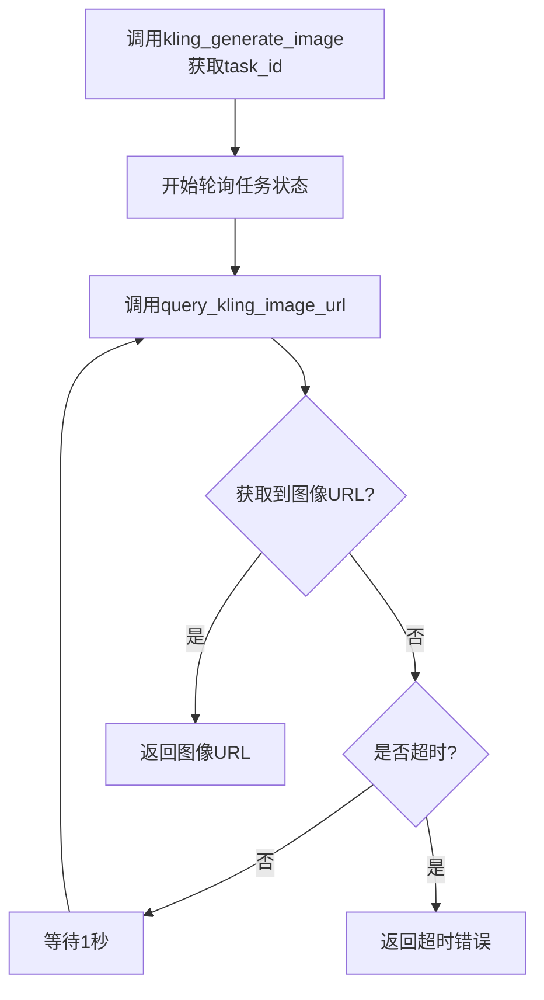

# 可灵 Kling 文生图

这是一个文生图的示例，使用 kling 生成图像。

::: info
图像生成是计算密集型任务，特别是高质量、高分辨率图像可能需要数十秒甚至数分钟处理时间，为了让用户发送请求后可以立即收到响应（任务ID），而不必等待整个生成过程，因此用户可以同时提交多个生成任务，然后异步查询结果。
同时这样的队列系统允许服务提供商根据可用GPU/TPU资源智能调度任务。
:::

通常来说，图像生成的常见流程是：

1. `POST`: 调用 `生成图像api` 提交图像生成任务，返回获取 `task_id`。
2. `GET`: 根据 `task_id` 调用 `查询图像api` 查看图像生成任务是否完成。

本示例实现了每隔一秒轮询任务状态，直到任务完成，然后返回图像 url。

## 代码示例

::: tip
背景深色为可以修改的参数，非必选参数已经注释，可以按照自己的需求启用。
:::

::: code-group

```python[python]{6-7,19-25}
import http.client
import json
import time

# 配置全局变量
API_URL = "www.dmxapi.cn" # API 节点
DMX_API_TOKEN = "sk-XXXXXXXXXX" # API 密钥

conn = http.client.HTTPSConnection(API_URL)

# 生成图像
def kling_generate_image():
    """
    使用 kling 生成图像
    返回参数:
        task_id: 生成任务的 id
    """
    payload = json.dumps({
    "model_name": "kling-v1-5", # [必选] string, 模型名称 可选择 kling-v1-5 或 kling-v1
    "prompt": "生成一张袋鼠的照片，手里拿着一个写着'DMXAPI'的牌子", # [必选] string, 正向文本提示词
    # "negative_prompt": "", # string, 负向文本提示词
    # "output_format": "png", # string, 输出格式：png 或 jpg
    # "n": 1, # int, 生成数量 [1, 9]
    # "aspect_ratio": "16:9", # string, 输出比例：16:9 或 9:16 或 1:1 或 4:3 或 3:4 或 3:2 或 2:3
    # "callback_url": "url", # string, 回调地址，可以用于 webhook 等通知场景
    })
    headers = {
    'Authorization': f'Bearer {DMX_API_TOKEN}',
    'Content-Type': 'application/json'
    }
    conn.request("POST", "/kling/v1/images/generations?=null", payload, headers)
    res = conn.getresponse()
    json_data = json.loads(res.read().decode("utf-8"))
    print(json_data)
    return json_data['data']['task_id']

def query_kling_image_url(task_id):
    """
    查询获取图像
    输入参数:
        task_id: 生成任务的 id
    输出参数:
        image_url: 图像 url
    """
    action = "images"
    action2 = "generations"

    query_path = f"/kling/v1/{action}/{action2}/{task_id}"

    headers = {
    'Authorization': f'Bearer {DMX_API_TOKEN}'
    }

    conn.request("GET", query_path, None, headers)
    res = conn.getresponse()
    json_data = json.loads(res.read().decode("utf-8"))
    if json_data['data']['task_status'] == "succeed":
        return json_data['data']['task_result']['images'][0]['url']
    else: 
        return None

def generate_image():
    """
    生成图像
    返回参数:
        image_url: 图像 url
    """
    task_id = kling_generate_image() # 调用生成图像 api 提交图像生成任务，返回获取 task_id。
    start_time = time.time()
    timeout = 60 # 队列等待超时时间

    while True:
        image_url = query_kling_image_url(task_id) # 根据 task_id 调用查询图像api 查看图像生成任务是否完成。
        if image_url is not None:
            return image_url

        if time.time() - start_time > timeout:
            print(f"请求达到 {timeout} 秒超时")
            return None

        time.sleep(1)
        print(f"等待图像生成，{int(time.time() - start_time)} 秒", flush=True)

if __name__ == "__main__":
    print(generate_image())
```

```sh [shell]

```

```go [go]

```

```js [js]

```

```java [java]

```

:::

## 返回结果

返回结果为图片的 url，每个 url 有效期一般为 3 天以内，尽快下载或者转存。

```
https://cdn.klingai.com/bs2/upload-kling-api/6567899185/image/CjikMGgHQaYAAAAAA1CAQw-0_raw_image_0.png
```


## 函数流程图

